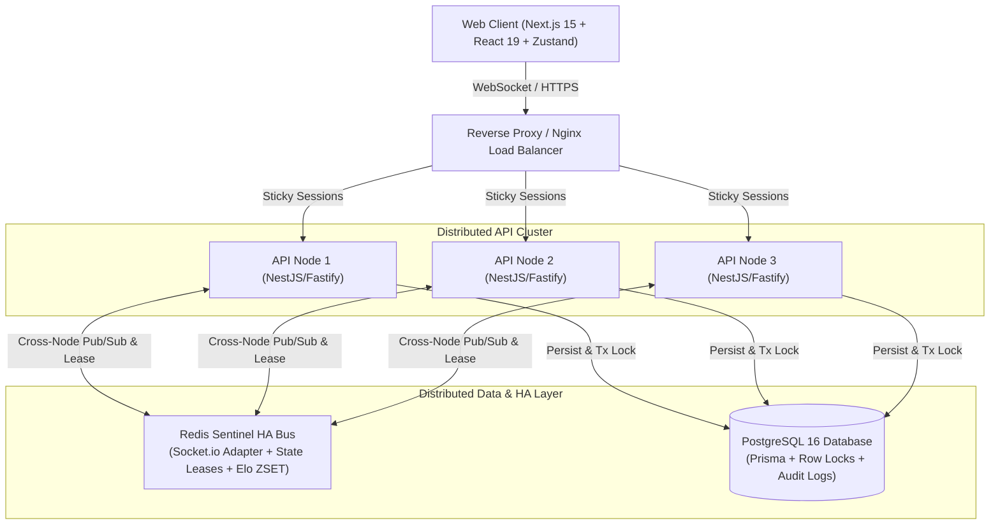

# Arena of 100 — Real-Time Battle Royale Quiz Platform

[](https://www.typescriptlang.org/)
[](https://nextjs.org/)
[](https://nestjs.com/)
[](https://www.fastify.io/)
[](https://socket.io/)
[](https://redis.io/)
[](https://www.postgresql.org/)
[](memory-bank/activeContext.md)
[](LICENSE)

> **High-Concurrency Benchmark**: Validated up to **8,000 concurrent WebSocket VUs** (80 concurrent rooms x 100 players) across a 3-node distributed cluster with 0 connect failures, 99.6% match completion rate, and sub-second answer latency (201ms @ 800 VU, 866ms @ 8,000 VU).
>
> **Recruiter & Engineering Review**: Read the 3-minute executive summary & STAR stories in [`memory-bank/recruiter-summary.md`](memory-bank/recruiter-summary.md).

---

## Overview

**Arena of 100** is a real-time multiplayer battle royale quiz platform where **100 players enter a match simultaneously**. Players answer timed trivia questions in rapid-fire rounds (15s). A single wrong answer or expired timer results in **instant elimination**, transitioning players into an interactive **Spectator Mode** until only one champion remains standing.

---

## Key Engineering & Product Highlights

- **100-Player Server-Authoritative Loop**: Anti-cheat by design. All timers, answer evaluations, and winner logic are strictly server-authoritative (`MatchStateMachine`).
- **Class & Tactical Card Hybrid Engine**: Offense (_Công_) vs Defense (_Thủ_) classes with 18 distinct tactical cards (Shields, Point Doublers, Freeze, Reveal) resolved via deterministic batch processing (`CARD_RESOLVED_BATCH` <= 50ms).
- **Elo Matchmaking & Rating Engine**: Dynamic K-factor ranking system with Redis ZSET matchmaking pools and background bot backfill.
- **Daily Challenge Mode**: Timezone-aware daily trivia sets with streak tracking and unlockable cosmetic card variants (Neon / Gold).
- **Delta Replay State Sync (`EVENT_BATCH`)**: Monotonic `seqNo` event-log enables zero-flicker re-hydration for mobile/reconnecting players without full snapshot overhead.
- **Zero-Downtime Distributed Runtime**: Redis Socket.IO adapter for multi-node broadcast, fenced owner leases for game-loop failover, and Redis Sentinel HA with automatic `READONLY` master error recovery.
- **2,398+ Automated Tests**: Comprehensive test suite (Unit, Integration, and Chaos Oracles) with >=90% code coverage across all monorepo packages.

---

## High-Level Architecture



---

## Monorepo Structure

```
arena-of-100/
├── apps/
│   ├── api/          # NestJS + Fastify + Socket.io backend
│   └── web/          # Next.js 15 + React 19 + Zustand frontend
├── packages/
│   ├── shared/       # Shared TypeScript types, Zod schemas, events, constants
│   └── game-core/    # Zero-dependency deterministic state machine & card engine
├── infrastructure/   # Docker Compose (PostgreSQL, Redis Standalone & Sentinel HA)
├── load-test/        # Distributed k6 test suite & chaos verification oracles
└── memory-bank/      # Technical specifications & executive summaries
```

---

## Tech Stack Matrix

| Layer                 | Technology                                     | Purpose                                                                |
| :-------------------- | :--------------------------------------------- | :--------------------------------------------------------------------- |
| **Frontend**          | Next.js 15 + React 19 + Zustand + Tailwind CSS | App Router, modular slice stores, responsive UI, i18n                  |
| **Backend**           | NestJS 10 + Fastify + Socket.io 4              | High-throughput asynchronous HTTP and WebSocket gateway                |
| **Database**          | PostgreSQL 16 + Prisma ORM                     | Relational persistence, transactional row locks (`FOR UPDATE`)         |
| **Distributed Cache** | Redis 7 + Redis Sentinel HA + `ioredis`        | Multi-node Socket.io adapter, ZSET queues, state leases                |
| **Testing**           | Vitest + k6                                    | 2,398+ automated unit/integration tests & multi-node load test harness |
| **Tooling**           | Turborepo + pnpm + Docker                      | Monorepo caching, strict type checking, container orchestration        |

---

## Quick Start Guide

### Prerequisites

- Node.js >= 20.0.0
- pnpm >= 9.x
- Docker & Docker Compose

### 1. Start Infrastructure

```bash
# Start PostgreSQL & Redis
docker compose -f infrastructure/docker-compose.yml up -d

# (Or for Redis Sentinel HA Cluster)
# docker compose -f infrastructure/docker-compose.sentinel.yml up -d
```

### 2. Install Dependencies

```bash
pnpm install
```

### 3. Setup Database & Seed Questions

```bash
# Copy environment configuration
cp apps/api/.env.example apps/api/.env

# Push Prisma schema to database
pnpm db:push

# Seed trivia questions
pnpm --filter @arena/api run prisma:seed
```

### 4. Run Development Servers

```bash
pnpm dev
```

- Web App: [http://localhost:3000](http://localhost:3000)
- API Server: [http://localhost:3001](http://localhost:3001)

---

## Documentation & Memory Bank

Explore the detailed architecture and engineering decision records in the [`memory-bank/`](memory-bank/) directory:

- [**Recruiter & Technical Summary**](memory-bank/recruiter-summary.md) — 3-minute executive summary, metrics table, and STAR engineering stories.
- [**Product Context**](memory-bank/productContext.md) — User experience vision, battle royale gameplay loops, and locked product decisions.
- [**System Patterns**](memory-bank/systemPatterns.md) — Deep architectural patterns (State Machine, Lease Fencing, Delta Replay, Sentinel HA).
- [**Tech Context**](memory-bank/techContext.md) — Detailed technical stack, infrastructure configuration, and local setup.
- [**Active Context & Progress**](memory-bank/activeContext.md) — Current verified status, test coverage, and benchmark results.
- [**Class & Cards Specification**](memory-bank/spec/class-cards-phase.md) — Complete specifications for the Class and Card hybrid mechanics.

---

## License

Distributed under the MIT License. See `LICENSE` for details.
