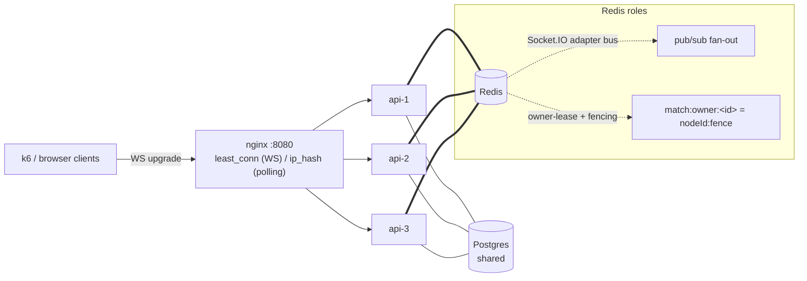

# Distributed Match Runtime — Architecture & Evidence

How Đấu Trường 100 went from a single-node, in-process game loop to a horizontally
scalable, failover-safe match runtime — three API nodes behind a load balancer, sharing
Postgres + Redis, with matches that survive their owner node being killed mid-flight.

> **Evidence status.** The correctness machinery (Stage B) is implemented and unit/integration
> tested. The measurement harness (Stage C) is complete and its pure logic is unit tested
> (`load-test/lib/reconnect.test.mjs`, `load-test/lib/failover-verdict.test.mjs`). The **measured
> numbers below are captured by running C1/C3 against the `docker:multi` cluster** — every figure
> names the exact artifact it is recomputed from. Cells marked _pending run_ are produced by that
> run (see [`load-test/MULTI-BASELINE.md`](../load-test/MULTI-BASELINE.md) and
> `load-test/scripts/chaos-failover.mjs`); do not quote a number here until its artifact exists.

---

## 1. Problem — the single-node ceiling

The match loop is timer-driven: `MatchRoundRunner` holds each round's countdown / evaluation
timers **in process** (`setTimeout`) and owns the authoritative `MatchStateMachine`. Two hard
limits follow:

1. **A node death loses the match.** The round timers and the live state machine live only in the
   dying process's heap. Nothing else can advance the round.
2. **Socket.IO broadcasts don't cross nodes.** `server.to(room).emit(...)` only reaches sockets
   connected to _this_ node's Socket.IO server. Two players of the same match on two nodes never
   see each other's events.

Single-node baseline (the "before" column, from the Plan-A full-match run —
`load-test/results/full-match-<baseline-commit>-*.json`): **100 concurrent WS, answer p95 ≈ 28 ms,
0 unexpected disconnects.** Correct and fast — but capped at one process and with zero fault
tolerance.

---

## 2. Target topology

`infrastructure/docker-compose.multi.yml`: nginx `:8080` → `arena-api-1/2/3`
(`INSTANCE_ID=api-1/2/3`, direct probe ports `:3011/:3012/:3013`) → shared Postgres + Redis.
**Redis plays two independent roles**: the Socket.IO **adapter bus** (cross-node fan-out) and the
**owner-lease store** (who drives each match, with fencing).

**LB policy.** `least_conn` for k6/websocket-only clients (even connection spread); `ip_hash` is
the right choice for browsers that fall back to HTTP long-polling (a polling session must stick to
one node). The single-IP k6 caveat: from one source IP, `ip_hash` would pin every VU to one node —
hence `least_conn` for the load test. See §6.

---

## 3. Cross-node fan-out — the Redis adapter

With `@socket.io/redis-adapter`, every `server.to(room).emit(evt, payload)` is also published on a
Redis pub/sub channel; each node's adapter receives it and re-emits to _its_ local room members.
So a match's players and spectators receive the same broadcast no matter which node their socket
landed on. This is what makes the LB's connection spreading safe: placement no longer has to match
match ownership.

The cost is one Redis pub/sub round-trip per broadcast — quantified in C1 as the adapter overhead
on answer latency vs the single-node baseline (§5).

---

## 4. Owner-lease + failover

Each match has exactly one **owner** node that drives its loop. Ownership is a fenced lease in
Redis:

- `match:owner:<id>` = `"<nodeId>:<fence>"`, TTL **15 s**, renewed by a **5 s heartbeat**
  (`assertOwnership` → `renewLease`).
- On launch a node acquires the lease (`acquireMatchLease`, Lua CAS) and mints a **monotonically
  increasing fence** (`nextFence`). Only the owner runs `MatchRoundRunner`.
- On owner death the lease TTL expires; another node's **orphan sweep** acquires it (a strictly
  higher fence), hydrates the persisted `MatchStateMachine`, and `resumeMatchLoop` **rebuilds the
  round timers from `phaseEndsAt`** (persisted deadline, not `Date.now() + phaseMax`). The match
  continues on the new node.

### The no-split-brain claim — stated only as far as the evidence carries it

A DB unique constraint alone does **not** prove single-writer safety. What the implementation
actually guarantees, layer by layer (each with its verifying artifact):

| Layer                    | Guard                                                                                                                                                          | Where                                                                                                                                 | Verified by                                                                     |
| ------------------------ | -------------------------------------------------------------------------------------------------------------------------------------------------------------- | ------------------------------------------------------------------------------------------------------------------------------------- | ------------------------------------------------------------------------------- |
| Canonical state writes   | Every `match:state` write goes through the **fenced Lua CAS** in `persistStateMachine`; a stale fence returns a non-`APPLIED` outcome and the write is dropped | B2c persist path at the 4 mutating boundaries (`executeRound`/`endRound`/`checkMatchEnd`/`finishMatchLoopInner`) + the B4b apply path | B2c integration specs; B4b answer-path specs                                    |
| Authoritative broadcasts | A Socket.IO emission of an authoritative event follows **only** an `APPLIED` CAS outcome / the fenced side-effect outbox                                       | B2c item 3; B4b `fencedSideEffects` (`publishAnswerResult`)                                                                           | B2c/B4b specs                                                                   |
| Timer callbacks          | `assertOwnership` (renew-or-lose) gates `endRound` / `checkMatchEnd` / `finishMatchLoopInner`                                                                  | B2c                                                                                                                                   | B2c specs                                                                       |
| Redis side effects       | Command-stream acks (B4a consume contract) and presence-leader mutations (B5 per-mutation CAS) validate their fence in the **same atomic op**                  | B4a, B5                                                                                                                               | B4a consume spec; B5 mid-sweep demotion test                                    |
| Runtime                  | The C3 oracle requires a fence-checked, **deduplicated, strictly-increasing** round sequence with no stale-fence post-kill broadcast                           | C3                                                                                                                                    | `failover-verdict.test.mjs`; a real `*.failover.json` from `chaos-failover.mjs` |

**Evidenced claim (safe to make):** _no unfenced canonical `match:state` write occurs, and
authoritative broadcasts are emitted only after an `APPLIED` fenced CAS._ The DB unique constraint
is a **backstop**, not the proof. The absolute "no split brain ever, on any path" invariant is
claimed only once the C3 chaos run has produced a green `*.failover.json` whose oracle confirms the
fence-checked round sequence at runtime; until then this is the narrower, guard-enumerated claim.

### Single-writer answers

`SUBMIT_ANSWER` is not applied locally. Every node (owner and non-owner) **durably forwards** a
command envelope on a Redis stream (`match:cmd:<id>`, B4a); the **owner's** consumer applies it
under a fence gate, dedupes by `eventId` / `submissionId`, and emits the canonical `ANSWER_RESULT`
(which the adapter fans out cross-node, B4b). One writer, one authoritative result, regardless of
which node received the click.

---

## 5. Measured evidence

Every figure names its **source artifact and exact fields** — no number appears without a file it
can be recomputed from (see [`load-test/README.md`](../load-test/README.md) §artifacts and
[`load-test/MULTI-BASELINE.md`](../load-test/MULTI-BASELINE.md)).

### Before / after

| Metric                     | Single-node (before) | 3-node (800 VU)                                         | 3-node (1600 VU)                                     | 3-node (3200 VU)                                     | Source                                            |
| -------------------------- | -------------------- | ------------------------------------------------------- | ---------------------------------------------------- | ---------------------------------------------------- | ------------------------------------------------- |
| Concurrent WS              | 100                  | 800                                                     | 1,600                                                | 3,200                                                | k6 summary                                        |
| Answer p95                 | ≈ 28 ms              | 201 ms                                                  | 356.8 ms                                             | 669 ms                                               | `answer_result_latency_ms.p(95)`                  |
| Answer p99                 | _from baseline json_ | n/a (not in summary)                                    | n/a (not in summary)                                 | n/a (not in summary)                                 | `answer_result_latency_ms.p(99)`                  |
| Messages/sec               | _from baseline json_ | 247.7 /s                                                | 471.9 /s                                             | 868.8 /s                                             | k6 `ws_messages_received` rate                    |
| Unexpected disconnect rate | 0                    | 0                                                       | 0                                                    | 0                                                    | `ws_unexpected_disconnect` / `ws_connect_success` |
| Per-node CPU / RSS         | n/a                  | `multi-800-fix-e48c7b4-20260728T134159.dockerstats.psv` | `multi-1600-e48c7b4-20260728T141317.dockerstats.psv` | `multi-3200-e48c7b4-20260728T151011.dockerstats.psv` | `dockerstats.psv` (`CPUPerc`, `MemUsage`)         |
| Socket distribution        | n/a (1 node)         | 3 nodes (34.4% / 32.6% / 33.0%)                         | 3 nodes (33.3% / 33.5% / 33.3%)                      | 3 nodes (33.4% / 33.7% / 32.9%)                      | `distribution.summary.json` (`peakSplit`)         |

- **"before"** ← `load-test/results/full-match-ed0b4ae-20260728T100000.json` (Plan A single-node 100-user baseline artifact).
- **"after"** ← canonical summary JSON & matching metrics artifacts by target scale:
  - **800 VU**: summary `load-test/results/multi-800-fix-e48c7b4-20260728T134159.json`, stats `load-test/results/multi-800-fix-e48c7b4-20260728T134159.dockerstats.psv`, dist `load-test/results/multi-800-fix-e48c7b4-20260728T134159-distribution.summary.json`
  - **1,600 VU**: summary `load-test/results/multi-1600-e48c7b4-20260728T141317.json`, stats `load-test/results/multi-1600-e48c7b4-20260728T141317.dockerstats.psv`, dist `load-test/results/multi-1600-e48c7b4-20260728T141317-distribution.summary.json`
  - **3,200 VU**: summary `load-test/results/multi-3200-e48c7b4-20260728T151011.json` (steady-state, excluding high-latency stress variant `multi-3200-slow-e48c7b4-20260728T152207.json`), stats `load-test/results/multi-3200-e48c7b4-20260728T151011.dockerstats.psv`, dist `load-test/results/multi-3200-e48c7b4-20260728T151011-distribution.summary.json`
- Adapter pub/sub overhead = (after answer p95) − (before answer p95); expected small, quantified
  from the two summary JSONs.

### Sockets-per-node over time (distribution)

Source: `load-test/results/<run>-distribution.jsonl`, one `{ts, nodeId, socketCount}` per line
(the C1 poller, `load-test/scripts/poll-distribution.mjs`). Plot `socketCount` vs `ts`, one series
per `nodeId`. The `*-distribution.summary.json` records the ≥ 2-node assertion + per-node peak split.

### Failover timeline (centerpiece)

Source: `load-test/results/failover-<commit>-<ts>.failover.json` (the C3 schema). Timeline:
`t_match_started → t_kill → t_owner_flip → t_recover → MATCH_FINISHED`, with `time_to_recover_ms`
annotated (threshold ≈ lease TTL + margin = 20 s). Overlay the answer-latency series around
`t_kill` (`answer_p95_failover_ms` vs `steady_state_p95_ms`) for the bounded-spike annotation.

The **round-index step chart** plots the artifact's `round_events` array (one
`{t, eventId, roundIndex, fence}` per deduplicated event the oracle evaluated): x = `t`,
y = `roundIndex`, **colored by `fence`** so the ownership handover is visible as a color change with
no duplicate or regressing round. Do **not** reconstruct it from `duplicate_round_check` counts —
the sequence itself is the source.

### Reconnect stats

Source: the failover k6 summary — `reconnect_success` (Rate) and `reconnect_ms` (Trend, p95). The
verdict's coverage gate ensures a node kill that dropped zero sockets is reported **INCONCLUSIVE**,
never a vacuous PASS.

> Generate the figures with a small Node script in the style of
> `load-test/scripts/validate-results.mjs` (no extra deps), keeping the raw artifact linked next to
> each figure so every number is auditable.

---

## 6. Trade-offs & limits

- **`least_conn` vs `ip_hash`.** k6 (websocket-only, single source IP) uses `least_conn` for even
  spread; browsers that long-poll need `ip_hash` (sticky) — a single-IP k6 run under `ip_hash`
  would pin every VU to one node and defeat the distribution test.
- **Redis is a SPOF.** Both the adapter bus and the lease store depend on one Redis. Redis
  Sentinel / Cluster is future work; today a Redis outage stalls the whole cluster.
- **Lease-TTL vs recovery-time tension.** A shorter TTL recovers faster after a kill but risks a
  false takeover under a GC pause / network blip; 15 s TTL + 5 s heartbeat trades recovery latency
  for stability. `time_to_recover` (C3) measures where that lands.
- **Adapter pub/sub overhead** on answer latency is real (one Redis round-trip per broadcast),
  quantified in C1 against the single-node baseline.
- **Simplification (B4b).** The answer path reuses `persistStateMachine` (APPLIED/RETRY) + the
  consumer's per-match serialization instead of a full snapshot/commit + durable outbox; adequate
  for single-writer correctness, noted as a deliberate scope choice.

---

## Artifacts index

| Artifact                                                          | Produced by             | Feeds                                      |
| ----------------------------------------------------------------- | ----------------------- | ------------------------------------------ |
| `multi-fullmatch-<commit>-<ts>.json`                              | C1 k6 run               | before/after table                         |
| `multi-fullmatch-<commit>-<ts>.node-{1,2,3}.cpu.jsonl`            | C1 samplers             | per-node CPU/RSS                           |
| `multi-fullmatch-<commit>-<ts>-distribution.{jsonl,summary.json}` | `poll-distribution.mjs` | distribution chart + ≥2-node assertion     |
| `failover-<commit>-<ts>.failover.json`                            | `chaos-failover.mjs`    | failover timeline + round-index step chart |
| `failover-<commit>-<ts>.k6-summary.json`                          | failover k6 run         | reconnect stats + answer p95               |
