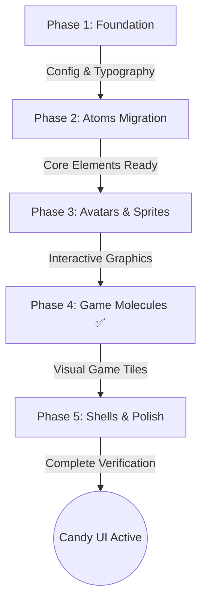

# Design System Migration Guide: Cyberpunk to Candy 3D Jelly UI

This document serves as the step-by-step master checklist and instruction manual for migrating the **Arena of 100** design system from the legacy Cyberpunk neon dark mode to the stunning, tactile **Candy 3D Jelly UI**.

This plan is intentionally divided into **5 clean, modular implementation phases** designed so that models with 256k token context windows (and smaller) can execute them sequentially and with absolute correctness.

---

## 🎨 Design Theme Specification

- **Background Style:** Exclusive, non-toggled Candy Light-Gradient (`linear-gradient(135deg, #FFF0F5 0%, #E6E6FA 50%, #E0F2FE 100%)`).
- **Contour & Ink Style:** Thick dark ink boundaries (`#2B2D42`, 3px to 5px solid borders) around all panels, buttons, and inputs.
- **3D Depth Effect:** Flat offset shadows rather than standard directional gradients. Interactive states depress directly on mouse click (reducing the shadow height and shifting the elements down).
- **Aesthetic Tone:** Playful, rounded, "juicy," bouncy, tactile, with custom Melbit World creatures and sequential spritesheets.

---

## 🗺️ Migration Steps Overview



**Status: Phase 4 Complete ✅** - All game molecules (AnswerTile, Timer, PlayerGrid) have been successfully migrated to the Candy 3D Jelly UI design system.

---

## 📂 Phase 1: Foundation (Tokens, Tailwind Config & CSS Layouts)

### Goal

Configure our custom Google fonts, register the new Candy Color Palette in TypeScript tokens, and inject core tactile styles (`.jelly-card`, `.jelly-btn`) into global stylesheets.

### Step 1.1: Font Loading Setup

Modify the root Next.js font loader in [layout.tsx](apps/web/src/app/%5Blocale%5D/layout.tsx):

- **Bungee**: Map to `--font-display` (heavy, rounded, uppercase titles).
- **Fredoka**: Map to `--font-sans` (default UI/body text, soft and rounded).
- **Gaegu**: Map to `--font-hand` (handwritten marker style, accents).
- Keep **JetBrains Mono** mapped to `--font-mono`.

```typescript
// Add imports
import { Bungee, Fredoka, Gaegu, JetBrains_Mono } from "next/font/google";

const displayFont = Bungee({
  weight: "400",
  subsets: ["latin"],
  variable: "--font-display",
});

const sansFont = Fredoka({
  subsets: ["latin", "vietnamese"],
  variable: "--font-sans",
});

const handFont = Gaegu({
  weight: ["300", "400", "700"],
  subsets: ["latin"],
  variable: "--font-hand",
});
```

### Step 1.2: Migrate TypeScript Colors Token

Update [colors.ts](apps/web/src/styles/tokens/colors.ts):

```typescript
export const COLORS = {
  candyInk: "#2B2D42", // Boundaries, outlines, solid ink text
  candyPink: "#FF85A2", // Accents, brand, streaks
  candyYellow: "#FFD000", // Gold stars, primary CTA, rank 1
  candyMint: "#2EC4B6", // Correct feedback, green lights
  candyBlue: "#3A86C8", // Info overlays, lobby headers
  candyRed: "#EF476F", // Eliminates, errors, sudden death danger
  candyPurple: "#A29BFE", // Matchmaking, mystery cards
  candyOrange: "#FF7A00", // Timer warning, queue states
  candyCloud: "#FDF0ED", // Soft contrast, active selections
  background: "#FFFFFF",
  white: "#FFFFFF",
} as const;
```

### Step 1.3: Update Tailwind Configuration

Extend the theme in [tailwind.config.ts](apps/web/tailwind.config.ts):

- Add custom fonts: `display: ["var(--font-display)"]`, `sans: ["var(--font-sans)"]`, `hand: ["var(--font-hand)"]`.
- Extend color mapping using the `COLORS` variables.
- Add keyframe animations for organic spring bounces:
  ```typescript
  keyframes: {
    wobble: {
      "0%, 100%": { transform: "scale3d(1, 1, 1)" },
      "30%": { transform: "scale3d(1.15, 0.85, 1)" },
      "40%": { transform: "scale3d(0.85, 1.15, 1)" },
      "50%": { transform: "scale3d(1.10, 0.90, 1)" },
      "65%": { transform: "scale3d(0.95, 1.05, 1)" },
      "75%": { transform: "scale3d(1.02, 0.98, 1)" },
    }
  },
  animation: {
    "jelly-wobble": "wobble 0.6s ease-in-out",
  }
  ```

### Step 1.4: Rewrite Globals & Custom CSS Utilities

Update [globals.css](apps/web/src/app/globals.css) and [utilities.css](apps/web/src/styles/utilities.css):

- Apply the exclusive light candy background directly onto the `body` tag:
  ```css
  body {
    background: linear-gradient(135deg, #fff0f5 0%, #e6e6fa 50%, #e0f2fe 100%);
    background-attachment: fixed;
    color: #2b2d42;
    font-family: var(--font-sans), sans-serif;
  }
  ```
- In `@layer utilities`, add the core Candy UI CSS primitives:

  ```css
  /* Tactile 3D Cards */
  .jelly-card {
    background: #ffffff;
    border: 3.5px solid #2b2d42;
    border-radius: 20px;
    box-shadow: 0 8px 0 0 #2b2d42;
    transition:
      transform 0.15s cubic-bezier(0.23, 1, 0.32, 1),
      box-shadow 0.15s cubic-bezier(0.23, 1, 0.32, 1);
  }
  .jelly-card:hover {
    transform: translateY(-4px);
    box-shadow: 0 12px 0 0 #2b2d42;
  }

  /* Glossy 3D Buttons */
  .jelly-btn {
    position: relative;
    font-family: var(--font-display), sans-serif;
    text-transform: uppercase;
    font-weight: 900;
    border: 3.5px solid #2b2d42;
    border-radius: 16px;
    box-shadow: 0 6px 0 0 #2b2d42;
    overflow: hidden;
    transition:
      transform 0.1s cubic-bezier(0.23, 1, 0.32, 1),
      box-shadow 0.1s cubic-bezier(0.23, 1, 0.32, 1);
  }
  .jelly-btn::before {
    content: "";
    position: absolute;
    top: 0;
    left: 0;
    right: 0;
    height: 35%;
    background: rgba(255, 255, 255, 0.35);
    border-radius: 12px 12px 0 0;
    pointer-events: none;
  }
  .jelly-btn:hover {
    transform: translateY(-2px);
    box-shadow: 0 8px 0 0 #2b2d42;
  }
  .jelly-btn:active {
    transform: translateY(4px);
    box-shadow: 0 2px 0 0 #2b2d42;
  }
  ```

### Phase 1 Verification Commands

```bash
# Verify Tailwind builds and Next compiles successfully
pnpm --filter @arena/web typecheck
```

---

## 📂 Phase 2: Atoms Migration (Button, Card, Badge, Input)

### Goal

Refactor all standard inputs and primitives inside `apps/web/src/components/ui/` to eliminate glowing lines/dark containers, replacing them with the new glossy tactile Candy classes.

### Step 2.1: Refactor `Button`

Update [button.tsx](apps/web/src/components/ui/button.tsx):

- Map styling to uses of `.jelly-btn`.
- Set background based on the variant mappings:
  - `primary` / `default` → `bg-candyYellow text-candyInk hover:bg-candyYellow/90`
  - `secondary` → `bg-candyBlue text-white`
  - `action` → `bg-candyMint text-candyInk`
  - `accent` → `bg-candyPink text-white`
  - `danger` → `bg-candyRed text-white`

### Step 2.2: Refactor `GlassPanel` (JellyCard)

Update [glass-panel.tsx](apps/web/src/components/ui/glass-panel.tsx):

- Remove background blur classes (`backdrop-blur-xl bg-surface-dim/80`).
- Apply the `.jelly-card` base class with `#FFFFFF` or `bg-candyCloud` as the body container backdrop.

### Step 2.3: Refactor `Badge` & `Input`

- Update [badge.tsx](apps/web/src/components/ui/badge.tsx): Set thick 2px borders using `#2B2D42` with vibrant solid fillings mapped to variants (e.g. online → Mint, eliminated → Red).
- Update [input.tsx](apps/web/src/components/ui/input.tsx): Round corners (`rounded-2xl`), inject thick 3.5px `#2B2D42` borders, and set active states to pop with a `shadow-3d` outline.

### Phase 2 Verification Commands

```bash
# Verify types and structure
pnpm --filter @arena/web typecheck
```

---

## 📂 Phase 3: Dynamic Sprites & Custom Avatar Generator

### Goal

Integrate procedural vector avatars and interactive 2D gameplay sprites directly into the UI.

### Step 3.1: Vector Procedural Avatars

Refactor the client fallback in [avatar.tsx](apps/web/src/components/ui/avatar.tsx):

- Create a fast hash function based on the username to procedurally render vector assets in SVG format.
- Randomly choose eye configurations (normal, wink, stars, round), skin backgrounds (`candyMint`, `candyPink`, `candyYellow`, `candyPurple`), cheek blushes, and unique horn vectors based on the character seed.
- Bind thick ink-outlines (`stroke="#2B2D42" strokeWidth="4"`) inside the SVG structure.

### Step 3.2: Reusable Animated Sprites Component

Create the new Next.js component: [melbit-sprite.tsx](apps/web/src/components/ui/melbit-sprite.tsx):

- Accept props like `sprite` (jellyfrog, dario, clippy), `animation` (idle, jump, celebrate), `size`, and `mirror`.
- Read and play animations sequentially. You can use standard CSS steps-based frame loops referencing the sprite assets in `apps/web/public/arena_of_100/sprites/` or standard visual sprite configurations.

### Phase 3 Verification Commands

```bash
# Compile check
pnpm --filter @arena/web typecheck
```

---

## 📂 Phase 4: Game Molecules (AnswerTile, Timer, PlayerGrid) - ✅ COMPLETED

### Goal

Update core quiz game visual components to support physical bouncy interactions and correct/incorrect answer states.

### Step 4.1: Refactor `AnswerTile` - ✅ COMPLETED

Modified [answer-tile.tsx](apps/web/src/components/game/answer-tile.tsx):

- Choices now render as 3D card columns using `.jelly-card` classes.
- State representations:
  - **Default State:** Soft white background with `3.5px` ink border and shadow.
  - **Selected State:** Moves downward by `4px` with reduced shadow offset; background switches to `bg-candyPink text-white`.
  - **Correct Selection:** Turns into `bg-candyMint text-candyInk` and triggers the `.animate-jelly-wobble` bounce state.
  - **Incorrect Selection:** Turns into `bg-candyRed text-white` and executes a physical `.animate-shake` translation.

### Step 4.2: Playful Progress Timer - ✅ COMPLETED

Modified [timer.tsx](apps/web/src/components/game/timer.tsx):

- Converted progress container into a thick pill outline with deep ink coloring.
- Render the decreasing bar as a bright orange/yellow jelly block.
- Applied bouncy wobble pulse animation when timing drops below 25%.

### Step 4.3: Contestant Grid - ✅ COMPLETED

Created [player-grid.tsx](apps/web/src/components/game/player-grid.tsx):

- Applied small `.jelly-card` rounded pills for active players.
- Applied grayscale + pulse animation on players when they are eliminated.

### Phase 4 Verification Commands - ✅ PASSED

```bash
# Verify component composition
pnpm --filter @arena/web typecheck
```

---

## 📂 Phase 5: Shells, Screens & Polish

### Goal

Replace any residual dark mode layout templates, update the shells (AppShell, GameShell), and verify the complete user flow with a high-fidelity visual web audit.

### Step 5.1: Update Shell Templates

- Refactor templates inside `apps/web/src/components/layout/` (AppShell, GameShell, GameContainer) to remove lingering radial gradients, cyberpunk grids, and glowing borders.
- Style headers and sidebars using the solid `.jelly-card` borders.

### Step 5.2: Clean Up Unused CSS files

- Safe-delete any legacy CSS styles in `apps/web/src/styles/components.css` or references that only apply to the cyberpunk HUD lines.

### Step 5.3: End-to-End Visual Audit

- Run local development environment:
  ```bash
  pnpm dev
  ```
- Manually test all routes in browser (Lobby, Match Room, Active Arena, Rankings, podium screen) to visually confirm perfect integration.
- Ensure all interactive elements have rich, tactile feedback, satisfying colors, clean margins, and clear typography.

---

## 💡 Quick Tips for 256k Context Models

- Do not attempt to modify all files at once. Perform edits sequentially following the phase structures.
- After each phase, execute `pnpm --filter @arena/web typecheck` to verify that there are no TS compiler regressions.
- If styling conflicts occur, check variables declared inside `globals.css` and verify that the target class has higher priority.
