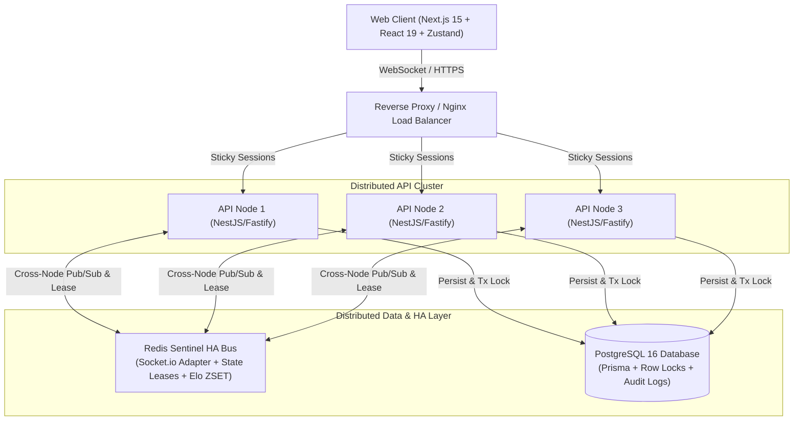

# Executive Summary & Recruiter Guide: Arena of 100

> **Target Audience**: Technical Recruiters, Engineering Managers, System Design Interviewers  
> **Estimated Reading Time**: 3-5 minutes  
> **Live Benchmark Highlights**: **8,000 concurrent WebSockets** (80 rooms x 100 players), 99.6% match finish rate, p95 answer latency 201ms @ 800 VU / 866ms @ 8,000 VU, 2,398+ automated tests, 0 connect failures.

---

## 1. Elevator Pitch

**Arena of 100** is a real-time multiplayer quiz battle royale built with a **distributed, server-authoritative architecture**. 100 players enter a room, answering timed trivia questions in rapid rounds. Wrong or missed answers result in instant elimination, transitioning players into an interactive spectator mode until only one champion remains.

Beyond a game, this project is a **high-concurrency engineering showcase** demonstrating production-grade distributed state synchronization, sub-second latency under load, anti-cheat security, automated failover, and comprehensive test discipline.

---

## 2. Key Engineering Highlights & Numbers

| Metric / Dimension        | Value / Achievement                                                      | Engineering Significance                                                          |
| :------------------------ | :----------------------------------------------------------------------- | :-------------------------------------------------------------------------------- |
| **Max Capacity Ceiling**  | **8,000 concurrent WebSocket VUs** (80 rooms x 100 players)              | Tested on 3-node distributed cluster via k6 multi-room distributed harness        |
| **Connection Integrity**  | **0 connect failures (100% connect success)**                            | Robust connection lifecycle, backpressure handling, and graceful degradation      |
| **Match Completion Rate** | **99.6% matches reach finished state** at 8,000 VU                       | Deterministic game-loop completion and presence tracking across distributed nodes |
| **Answer Latency (p95)**  | **201ms @ 800 VU \| 357ms @ 1,600 VU \| 669ms @ 3,200 VU \| 866ms @ 8k** | Sub-second latency scaling curve across 3 backend worker nodes                    |
| **Consumer Optimization** | **1,126ms -> 201ms (-82% latency drop)**                                 | Eliminated timer-bound polling bottleneck with event-driven batch processing      |
| **Test Footprint**        | **2,398+ passing tests** (Vitest / Unit / Integration / Chaos)           | >=90% code coverage gate across game logic, API, socket gateway, and client       |
| **High Availability**     | **Redis Sentinel (1 Master, 2 Replicas, 3 Sentinels)**                   | Automatic failover with `READONLY` error detection and zero manual intervention   |
| **State Synchronization** | **Monotonic `seqNo` Delta Replay (`EVENT_BATCH`)**                       | Reconnects resume exactly where left off without full-state re-hydration overhead |

---

## 3. Architecture & Core Systems



### Core Architectural Patterns:

1. **Server-Authoritative Game Loop**: All round countdowns, answer validity, eliminations, and card mechanics execute solely on the backend (`MatchStateMachine`). Clients send _intent_ only, preventing speedhacks and memory tampering.
2. **Distributed Match Runtime & Lease Fencing**: Each match is owned by a single worker node using a distributed lease with monotonic fencing tokens. Node crashes trigger seamless owner failover without disrupting in-flight matches.
3. **Delta Replay Contract (`lastSeenSeqNo`)**: Every game event receives a monotonic sequence number. Reconnecting clients request delta packets (`EVENT_BATCH`), ensuring uninterrupted gameplay over mobile networks.
4. **Clean Monorepo Boundaries**:
   - `@arena/shared`: Pure domain types, events, constants, and payload validators.
   - `@arena/game-core`: Pure TypeScript deterministic state machine and game math (zero external dependencies).
   - `@arena/api`: NestJS + Fastify + Socket.io backend with Redis Sentinel and Prisma ORM.
   - `@arena/web`: Next.js 15 + React 19 + Zustand frontend with tailwind styling and i18n.

---

## 4. Feature Landscape

- **100-Player Battle Royale**: 15s rapid-fire rounds, instant elimination, and sudden-death tie-breaking by response timestamp.
- **Class & Card Hybrid System**: Players are assigned into _Offense_ or _Defense_ classes, unlocking 18 tactical cards (Shields, Double Points, Freeze, Reveal) resolved via deterministic batch processing (`CARD_RESOLVED_BATCH`).
- **Elo & Matchmaking Queue**: Dynamic K-factor rating system with Redis ZSET matchmaking pools and background bot backfill.
- **Daily Challenge & Streaks**: Daily curated quiz sets with streak tracking and progressive cosmetic card variant unlocks (Default, Neon, Gold).
- **Drop-in Spectating**: Eliminated or late-joining players smoothly transition to real-time spectator view with micro-interactions.
- **Anti-Cheat & Concurrency Guard**: Idempotent answer submissions (`submissionId`), `SELECT ... FOR UPDATE` room joins, and generation counter socket kick-race prevention.

---

## 5. System Design & Problem-Solving Stories (STAR Method)

### Story 1: The 1,126ms -> 201ms Bottleneck (Timer-Bound Consumer)

- **Situation**: During multi-node load testing at 800 VU, answer submission latency showed an alarming p95 of 1,126ms despite CPU utilization sitting comfortably below 10%.
- **Diagnosis**: Latency was bimodal (`min=2ms`, `max=1,217ms`). Investigation revealed a timer-bound Redis Stream consumer: `setInterval(250ms)` with a rigid `BATCH=16` limit. When 69 players submitted answers simultaneously, queue backlog caused up to `ceil(69/16) * 250ms = 1,250ms` queue delay.
- **Solution**: Re-architected `MatchCommandService` into an **event-driven, self-rearming read loop** with dynamic batch sizing (`BATCH=128`) and offloaded `XAUTOCLAIM` maintenance to a background 5s cadence.
- **Result**: **p95 latency plunged from 1,126ms to 201ms (-82%)** with zero increase in CPU usage.

### Story 2: Database Connection Pool Ceiling vs. Test Variance

- **Situation**: At 1,600 concurrent VUs, requests started failing abruptly. Initial benchmark runs suggested a pool size of 50 was problematic, showing high latency.
- **Diagnosis**: Discovered that Prisma defaulted to 10 connections per node (30 total across 3 nodes), saturating Postgres completely. The initial conclusion was distorted by single-run test noise.
- **Solution**: Configured explicit `DB_POOL_MAX=20` per node and conducted **interleaved repeat testing** (cycling 20, 10, 32, 32, 20, 10) to isolate variance.
- **Result**: Proved that pool ceiling was the sole bottleneck. Active connections stabilized at 19/60 with 0 lock-waits and zero connection drops across 3,200 VU runs.

### Story 3: Zero-Downtime Redis Sentinel HA

- **Situation**: Redis acted as the single point of failure (SPOF) for Socket.io cross-node communication and match state leases.
- **Solution**: Implemented a 3-Sentinel high-availability cluster with automatic master promotion. Custom-wrapped `ioredis` with `reconnectOnError` to catch `READONLY` exceptions during Redis master failover and seamlessly re-route traffic.
- **Result**: Demonstrated uninterrupted socket event delivery and continuous match state recovery during abrupt Redis master kill events.

---

## 6. Quick Start & Verification

```bash
# 1. Start Standard Infrastructure (PostgreSQL + Redis for local dev)
docker compose -f infrastructure/docker-compose.yml up -d
# (Or use infrastructure/docker-compose.sentinel.yml for in-network Sentinel HA cluster)

# 2. Install dependencies
pnpm install

# 3. Setup Database Schema & Seed Data
pnpm db:push
pnpm --filter @arena/api run prisma:seed

# 4. Start Development Servers
pnpm dev
# Web App -> http://localhost:3000
# API Gateway -> http://localhost:3001
```
