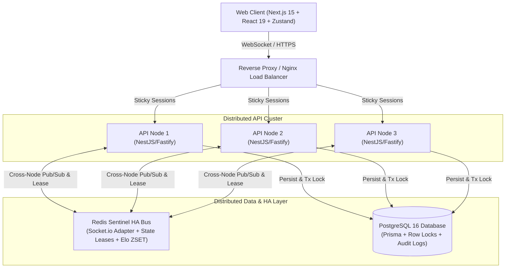
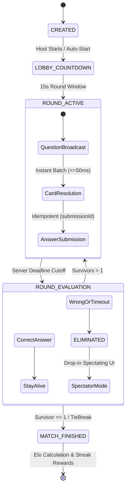

# System Patterns: Arena of 100

> **Core memory-bank file 2/4**  
> Documentation of production architecture and implemented design patterns in the codebase.  
> Recruiter & System Design overview: see `recruiter-summary.md`

---

## 1. Architecture Snapshot

- **Modular Monolith with Package Boundaries**:
  - `packages/shared`: Shared contracts, Zod schemas, event factories (`createEvent`), error codes, and constants.
  - `packages/game-core`: Pure deterministic state machine (`MatchStateMachine`), card resolution engine, class engine, tie-break algorithms (zero external framework dependencies).
  - `apps/api`: NestJS + Fastify HTTP runtime + Socket.io gateway + Redis Sentinel connection pool + Prisma ORM.
  - `apps/web`: Next.js 15 (App Router) + React 19 + Zustand modular slice store + Tailwind CSS + full i18n support.
- **Server-Authoritative Gameplay**: All countdowns, answer validity, card interactions, eliminations, and rankings are calculated on the backend.
- **Distributed State & Real-Time Sync**:
  - Redis Socket.IO Adapter for multi-node cross-worker WebSocket broadcasting.
  - Redis Sentinel HA (1 Master, 2 Replicas, 3 Sentinels) with auto-reconnection on `READONLY` master failover.
  - Monotonic `seqNo` Append-Only Event Log for delta state replay (`EVENT_BATCH`).

---

## 2. Core Implemented Patterns

### 1. Deterministic State Machine Pattern

**Location**: `packages/game-core/src/match-state-machine.ts`

- Encapsulates the entire match lifecycle: `CREATED` -> `LOBBY_COUNTDOWN` -> `ROUND_ACTIVE` -> `ROUND_EVALUATION` -> `MATCH_FINISHED`.
- Handles round generation, answer validation, immediate elimination, card modifier applications, and winner determination.
- Fully isolated and tested with 280+ pure unit tests in `@arena/game-core`.

### 2. Distributed Owner Lease & Fencing Token Pattern

**Location**: `apps/api/src/modules/match/services/match-owner.service.ts`

- Multi-node scalability: only one worker node holds the active execution lease for a specific match.
- Redis-based owner key with TTL and monotonic fencing token to prevent split-brain execution during node failover.
- Worker node crashes trigger automated lease acquisition by healthy peer nodes.

### 3. Delta Replay & Event Sourcing Contract

**Location**: `packages/game-core/src/match-state-machine.ts` + `apps/api/src/gateways/handlers/match.handler.ts`

- Every match mutation generates an immutable event with a monotonic `seqNo`.
- When a client reconnects, it transmits its `lastSeenSeqNo`. The server evaluates:
  - If `seqNo` is within retained history window: emits lightweight `EVENT_BATCH` (delta packets).
  - If `seqNo == 0` or stale: emits full `SNAPSHOT`.
- Result: Instant, zero-flicker re-hydration over mobile/unstable connections.

### 4. Event-Driven Self-Rearming Consumer Pattern

**Location**: `apps/api/src/modules/match/services/match-command.service.ts`

- High-throughput command processing for 100+ players submitting answers simultaneously in a 200ms burst.
- Replaced timer-bound `setInterval(250ms)` with a self-rearming read loop + dynamic batching (`BATCH=128`).
- Offloaded `XAUTOCLAIM` to background cadence, dropping p95 answer latency from **1,126ms to 201ms (-82%)**.

### 5. Idempotent Command & Concurrency Control Pattern

**Location**: `apps/api/src/gateways/handlers/match.handler.ts` & `room.service.ts`

- **Submission Idempotency**: `submitAnswer` accepts a unique `submissionId` per client round attempt, caching the canonical result to prevent duplicate processing on network retries.
- **Transactional Row Locking**: `SELECT ... FOR UPDATE` in PostgreSQL prevents race conditions during simultaneous room joins.
- **Socket Generation Counters**: Protects against stale socket kick races during rapid tab refreshes.

### 6. Card & Effect Batch Resolution Pipeline

**Location**: `packages/game-core/src/card-engine.ts` + `spec/class-cards-phase.md`

- 18 tactical cards (Offense/Defense) resolved immediately within a strict AOE cap (<=2/round).
- Micro-batched into `CARD_RESOLVED_BATCH` (<=50ms) to guarantee clock-drift safety and client synchronization.

### 7. Matchmaking & Dynamic Elo Queue (Redis ZSET)

**Location**: `apps/api/src/modules/matchmaking/`

- Players enter Redis Sorted Sets scored by their Elo rating.
- Background worker scans rating windows ($[Elo - \Delta, Elo + \Delta]$) with exponential window expansion.
- Automated bot backfill ensures games pop within acceptable player wait thresholds.

---

## 3. Reliability & Fault Tolerance Patterns

1. **Redis Sentinel HA & `reconnectOnError`**: Automatically catches `READONLY` exceptions during Redis master failover and transparently redirects commands to newly elected masters.
2. **Graceful Degradation**: If third-party question APIs fail, the system falls back to a curated local PostgreSQL question pool.
3. **Admin Kill-Switch & Audit Event Log**: Immediate operational kill-switch with append-only database audit logs for regulatory compliance and operational security.
